# Maison Noir Booking - dokumentacja frontendu

## 1. Cel projektu

Maison Noir Booking to frontend aplikacji webowej i mobilnej dla salonu fryzjerskiego. Aplikacja łączy publiczną stronę salonu, system rezerwacji wizyt oraz panele użytkowników zależne od roli: klienta, fryzjera i administratora.

Projekt został przygotowany jako aplikacja typu SPA/mobile-first z wykorzystaniem React Native, Expo i TypeScript. Frontend komunikuje się z backendem działającym w chmurze Azure oraz korzysta z mechanizmów autoryzacji, uploadu plików, galerii, recenzji i powiadomień SignalR.

Główne założenia:

- publiczna prezentacja salonu w estetyce premium beauty/luxury,
- możliwość przeglądania usług, fryzjerów, galerii i opinii bez logowania,
- logowanie użytkowników przez Google lub GitHub,
- rezerwacja wizyt przez klienta,
- panel klienta z profilem, wizytami i opiniami,
- panel fryzjera z wizytami, statystykami i historią klientów,
- panel administratora do zarządzania usługami, klientami, fryzjerami, galerią, opiniami, użytkownikami i rolami.

## 2. Stos technologiczny

Frontend został zbudowany w oparciu o:

| Technologia | Zastosowanie |
| --- | --- |
| React 19 | Budowa interfejsu użytkownika w oparciu o komponenty |
| React Native 0.81 | Wspólny model komponentów dla wersji mobilnej i webowej |
| Expo SDK 54 | Uruchamianie, budowanie i eksport aplikacji |
| React Native Web | Uruchomienie aplikacji React Native jako aplikacji webowej |
| TypeScript | Typowanie modeli, API i komponentów |
| Microsoft SignalR | Powiadomienia realtime z backendu |
| Expo Document Picker | Wybór plików przy uploadzie zdjęć |
| Expo Secure Store | Bezpieczne przechowywanie tokenu Easy Auth w aplikacji mobilnej |
| React Native Safe Area Context | Obsługa bezpiecznych marginesów na urządzeniach mobilnych |
| Lucide React Native | Ikony w nawigacji i przyciskach |
| Expo Linear Gradient | Efekty wizualne i tła w interfejsie |

Najważniejsze pliki konfiguracyjne:

- `package.json` - zależności i skrypty uruchomieniowe,
- `app.json` - konfiguracja Expo, nazwa aplikacji, pakiet Androida i ustawienia web,
- `.env` - adres backendu i konfiguracja logowania,
- `eas.json` - konfiguracja buildów Expo Application Services.

## 3. Architektura aplikacji

Projekt jest podzielony na kilka warstw:

```text
src/
├── api/          # komunikacja z backendem
├── components/   # komponenty UI wielokrotnego użytku
├── context/      # globalny stan aplikacji
├── hooks/        # hooki do danych i SignalR
├── layout/       # układ aplikacji i nawigacja
├── pages/        # ekrany aplikacji
├── router/       # prosty router SPA
├── theme/        # tokeny kolorów, odstępów i designu
├── types/        # typy domenowe
└── utils/        # funkcje formatujące i mapujące dane
```

Schemat przepływu danych:

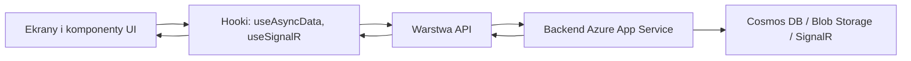

### 3.1. Warstwa API

Warstwa API ukrywa szczegóły endpointów backendu przed ekranami aplikacji. Ekrany nie wykonują bezpośrednio `fetch`, tylko korzystają z funkcji serwisowych.

Najważniejsze pliki:

- `src/api/client.ts` - wspólny klient HTTP, obsługa błędów, `credentials: "include"`, token mobilny `X-ZUMO-AUTH`, upload plików,
- `src/api/auth.ts` - logowanie, aktualny użytkownik, Easy Auth,
- `src/api/customers.ts` - profil klienta, wizyty klienta, usunięcie konta,
- `src/api/hairdressers.ts` - fryzjerzy, dostępność, wizyty fryzjera, upload zdjęcia,
- `src/api/services.ts` - usługi salonu,
- `src/api/appointments.ts` - wizyty i zmiana statusów,
- `src/api/gallery.ts` - galeria salonu i upload zdjęć,
- `src/api/reviews.ts` - opinie klientów,
- `src/api/admin.ts` - funkcje administracyjne,
- `src/api/signalr.ts` - konfiguracja połączenia SignalR.

### 3.2. Typy domenowe

Modele danych znajdują się w `src/types/domain.ts`. Typy opisują m.in.:

- użytkownika aplikacji,
- klienta,
- fryzjera,
- usługę,
- wizytę,
- zdjęcie galerii,
- opinię,
- role użytkowników.

Dzięki TypeScriptowi formularze i widoki są dopasowane do realnych struktur danych zwracanych przez backend.

### 3.3. Globalny stan

Aplikacja korzysta z React Context:

- `src/context/AuthContext.tsx` - stan logowania, aktualna rola, użytkownik, logowanie, wylogowanie, rejestracja profilu,
- `src/context/ToastContext.tsx` - komunikaty sukcesu i błędu,
- `src/router/RouterContext.tsx` - obsługa ścieżek aplikacji.

### 3.4. Komponenty UI

Wspólne komponenty znajdują się w `src/components/Primitives.tsx`. Są to m.in.:

- `Button`,
- `Card`,
- `Chip`,
- `Field`,
- `PageHeader`,
- `DataTable`,
- `StateView`,
- `SelectRail`.

Dzięki nim aplikacja ma spójny wygląd, a widoki administracyjne, formularze i listy zachowują jednolite zasady działania.

## 4. Wzorce projektowe użyte we frontendzie

### 4.1. Layered Architecture

Aplikacja jest podzielona na warstwy: API, typy, context, hooki, komponenty i ekrany. Ten podział ułatwia rozwój projektu i ogranicza mieszanie logiki widoku z logiką komunikacji z backendem.

Miejsca w kodzie:

- `src/api/`,
- `src/components/`,
- `src/context/`,
- `src/hooks/`,
- `src/pages/Screens.tsx`,
- `src/types/domain.ts`.

### 4.2. Service Layer

Każdy obszar backendu ma swój serwis, np. `customersApi`, `hairdressersApi`, `appointmentsApi`, `reviewsApi`. Widoki używają funkcji serwisowych zamiast ręcznie budować zapytania HTTP.

Miejsca w kodzie:

- `src/api/customers.ts`,
- `src/api/hairdressers.ts`,
- `src/api/services.ts`,
- `src/api/appointments.ts`,
- `src/api/gallery.ts`,
- `src/api/reviews.ts`,
- `src/api/admin.ts`.

### 4.3. Context Provider

Stan logowania, toasty i routing są udostępniane przez providery React Context. Dzięki temu każdy ekran może korzystać z aktualnego użytkownika, roli i nawigacji.

Miejsca w kodzie:

- `src/context/AuthContext.tsx`,
- `src/context/ToastContext.tsx`,
- `src/router/RouterContext.tsx`.

### 4.4. Protected Routes / Route Guards

Aplikacja rozpoznaje role użytkowników i pokazuje odpowiednie widoki. Gość nie może rezerwować wizyt, klient nie ma dostępu do panelu admina, a fryzjer korzysta z własnego panelu.

Miejsca w kodzie:

- `src/layout/AppShell.tsx` - menu zależne od roli,
- `src/pages/Screens.tsx` - widok braku uprawnień i ekrany rolowe.

### 4.5. Wizard Pattern

Rezerwacja wizyty jest procesem krokowym. Użytkownik przechodzi przez wybór usługi, fryzjera, daty, godziny i podsumowanie.

Miejsce w kodzie:

- `src/pages/Screens.tsx`, komponent `BookingPage`.

### 4.6. Observer / Event-driven UI

Powiadomienia SignalR są obsługiwane zdarzeniowo. Frontend nawiązuje połączenie z hubem i reaguje na eventy z backendu toastami.

Miejsca w kodzie:

- `src/api/signalr.ts`,
- `src/hooks/useSignalR.ts`.

### 4.7. Reusable Components

Widoki są składane z małych komponentów wielokrotnego użytku. Pozwala to zachować spójność wizualną oraz ograniczyć powtarzanie kodu.

Miejsce w kodzie:

- `src/components/Primitives.tsx`.

## 5. Role użytkowników

Aplikacja obsługuje cztery stany użytkownika:

| Rola | Możliwości |
| --- | --- |
| Gość | Przeglądanie strony głównej, usług, fryzjerów, galerii, kontaktu i opinii |
| Klient | Rezerwacja wizyt, historia wizyt, profil, opinie, odwołanie wizyty, usunięcie konta |
| Fryzjer | Panel pracy, lista wizyt, filtrowanie wizyt, zmiana statusu wizyty, historia klientów, podgląd profilu |
| Admin | Zarządzanie użytkownikami, rolami, klientami, fryzjerami, usługami, wizytami, opiniami i galerią |

Nazwy ról prezentowane w UI:

- `Customer` -> `Klient`,
- `Hairdresser` -> `Fryzjer`,
- `Admin` -> `Admin`.

Mapowanie znajduje się w `src/utils/format.ts`.

## 6. Widoki publiczne

### 6.1. Strona główna

Strona główna pełni rolę wejścia do aplikacji. Prezentuje markę Maison Noir, hero section, wyróżniki salonu oraz zachęca do rezerwacji lub przeglądania usług.

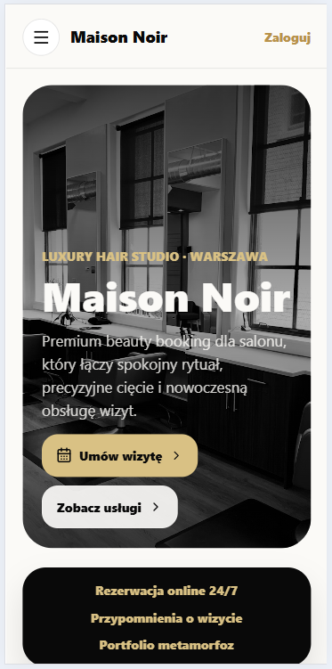

Elementy widoku:

- hero section ze zdjęciem salonu,
- CTA `Umów wizytę`,
- CTA `Zobacz usługi`,
- wyróżniki salonu,
- nawigacja publiczna.

### 6.2. Usługi

Widok usług pobiera dane z backendu i prezentuje ofertę salonu. Użytkownik może przeglądać usługi, sortować je i rozpocząć proces rezerwacji.

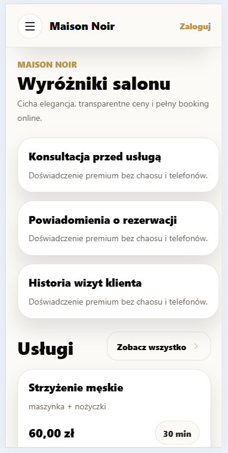

Elementy widoku:

- lista usług,
- opis usługi,
- cena,
- czas trwania,
- informacja o dostępności,
- przycisk rezerwacji.

### 6.3. Fryzjerzy

Widok fryzjerów prezentuje aktywnych członków zespołu. Każdy fryzjer posiada kartę z imieniem, nazwiskiem, specjalizacją, zdjęciem oraz akcjami.

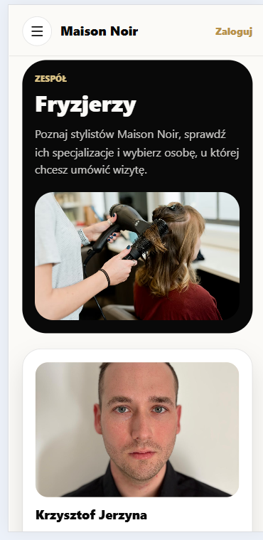

Elementy widoku:

- zdjęcie fryzjera,
- imię i nazwisko,
- specjalizacja,
- przycisk profilu,
- przycisk rezerwacji.

### 6.4. Profil fryzjera

Profil fryzjera prezentuje szczegóły stylisty oraz dostępność terminów.

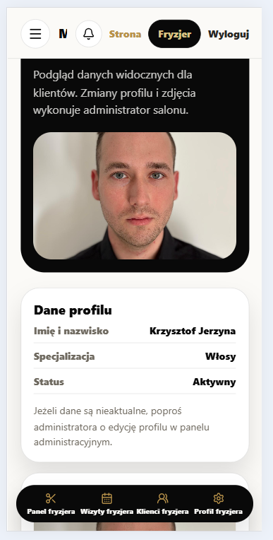

Elementy widoku:

- zdjęcie,
- dane fryzjera,
- specjalizacja,
- dostępność,
- przycisk rezerwacji u konkretnego fryzjera.

### 6.5. Galeria

Galeria prezentuje zdjęcia salonu i efektów pracy. Zdjęcia są pobierane z backendu, a backend przechowuje je z wykorzystaniem Azure Blob Storage.

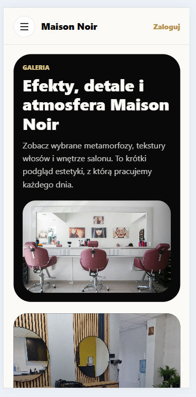

### 6.6. Opinie

Widok opinii pokazuje publiczne recenzje klientów. Widoczne są tylko opinie oznaczone jako publiczne.

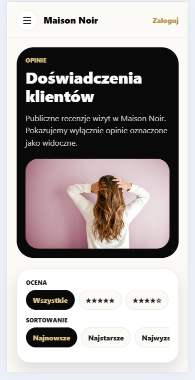

### 6.7. Kontakt

Widok kontaktu prezentuje dane salonu, lokalizację i godziny otwarcia.

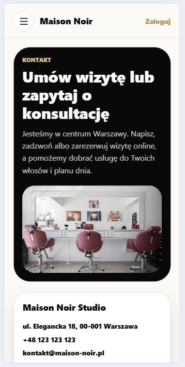

Aktualne godziny otwarcia:

- codziennie od 9:00 do 17:00.

## 7. Logowanie i autoryzacja

Logowanie w wersji webowej odbywa się przez Azure App Service Easy Auth. Użytkownik może wybrać Google lub GitHub. W wersji mobilnej na Androidzie używane jest natywne logowanie Google, a następnie token jest wymieniany po stronie backendu na sesję Easy Auth.

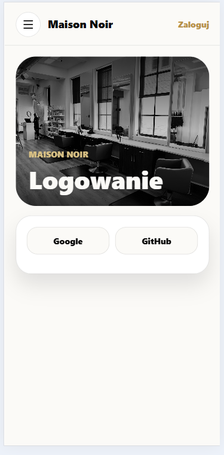

Po zalogowaniu aplikacja:

1. odczytuje sesję użytkownika,
2. pobiera rolę,
3. przekierowuje użytkownika do właściwego panelu,
4. pokazuje komunikat toast.

Jeśli użytkownik nie ma dostępu do widoku, otrzymuje ekran braku uprawnień:

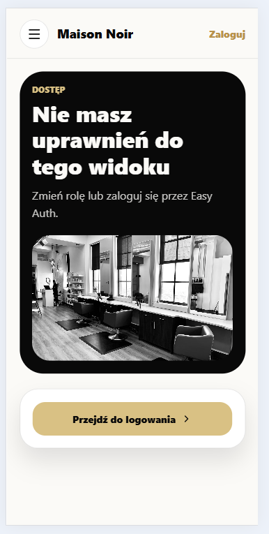

## 8. Proces rezerwacji wizyty

Booking został zaprojektowany jako wizard krok po kroku.

### Krok 1: wybór usługi

Klient wybiera usługę z listy pobranej z backendu.

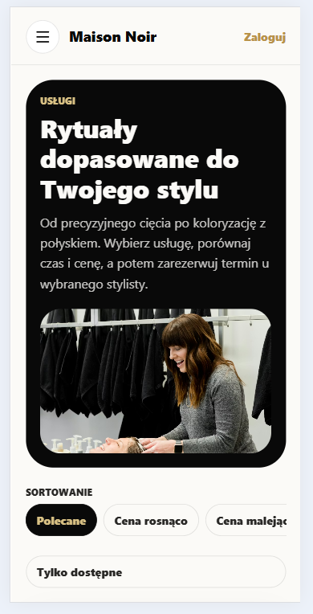

### Krok 2: wybór fryzjera

Klient wybiera fryzjera spośród aktywnych stylistów.

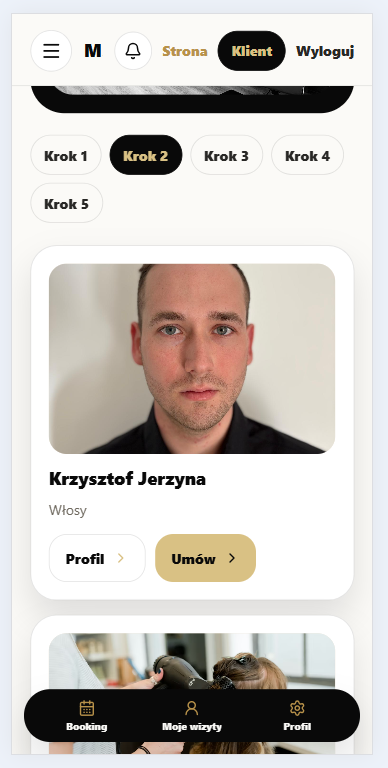

### Krok 3: wybór daty

Klient wybiera datę wizyty. Frontend jest dostosowany do godzin pracy salonu 9:00-17:00.

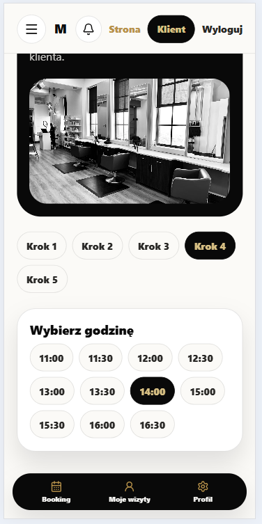

### Krok 4: wybór godziny

Po wybraniu fryzjera i daty aplikacja pobiera dostępne sloty z backendu.

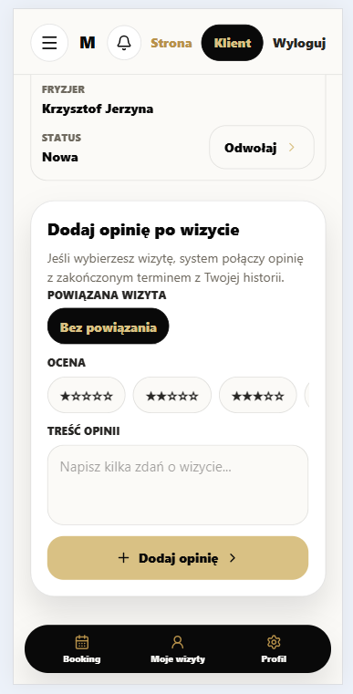

### Krok 5: podsumowanie

Na końcu klient widzi podsumowanie wizyty i potwierdza rezerwację.

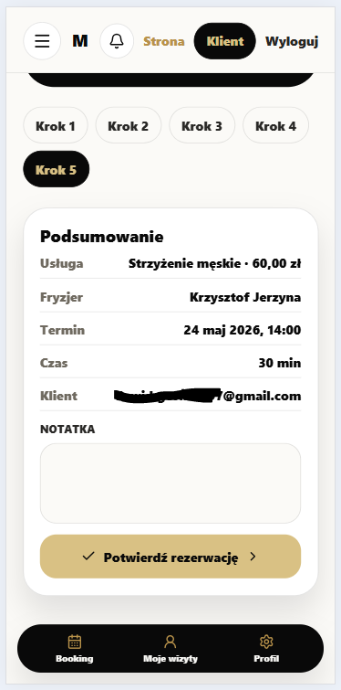

## 9. Panel klienta

Klient ma dostęp do profilu, historii wizyt, opinii oraz możliwości odwołania wizyty.

### 9.1. Profil klienta

Widok profilu pozwala uzupełnić i edytować podstawowe dane kontaktowe używane przy rezerwacjach.

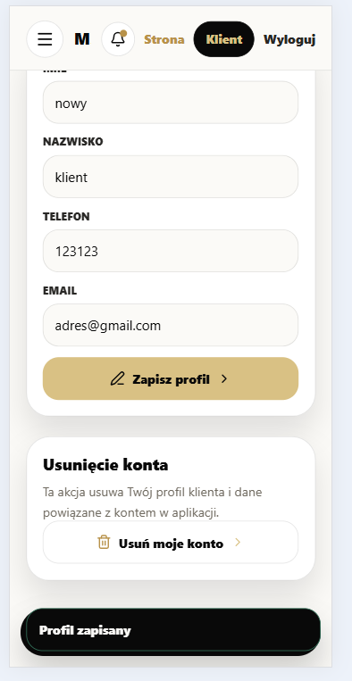

### 9.2. Moje wizyty

Widok wizyt prezentuje terminy klienta, statusy oraz akcje dotyczące wizyty.

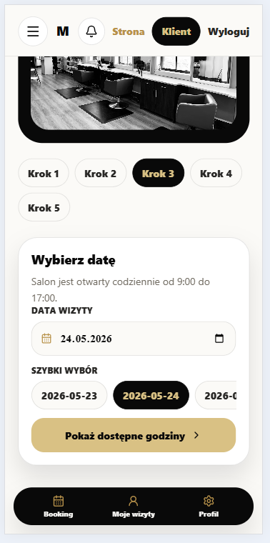

### 9.3. Opinie klienta

Klient może dodać opinię po wizycie. Opinia może być powiązana z konkretną wizytą, jeśli spełnia wymagania backendu.

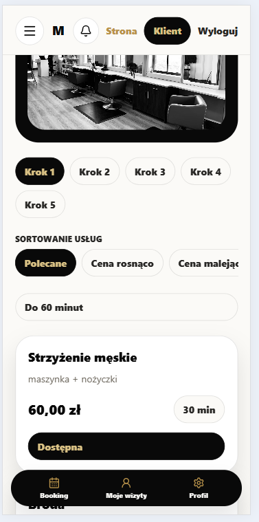

### 9.4. Usunięcie konta

Klient ma możliwość usunięcia swojego konta z poziomu profilu. Operacja wymaga potwierdzenia.

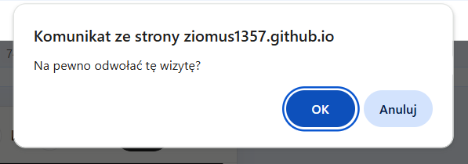

## 10. Panel fryzjera

Panel fryzjera jest przeznaczony dla użytkowników z rolą `Fryzjer`.

### 10.1. Dashboard fryzjera

Dashboard pokazuje skrót informacji o pracy fryzjera.

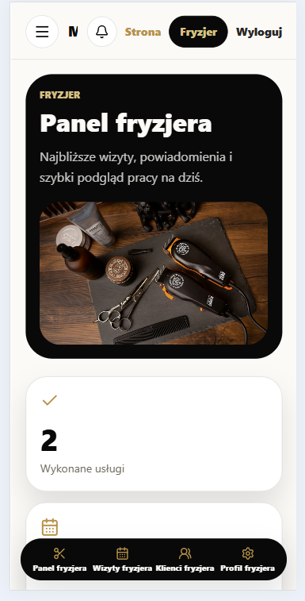

Przykładowe informacje:

- liczba wykonanych usług,
- liczba zaplanowanych wizyt,
- najbliższa wizyta,
- statystyki pracy.

### 10.2. Wizyty fryzjera

Fryzjer może przeglądać swoje wizyty, filtrować je po dacie, kliencie i statusie oraz zmieniać status wizyty.

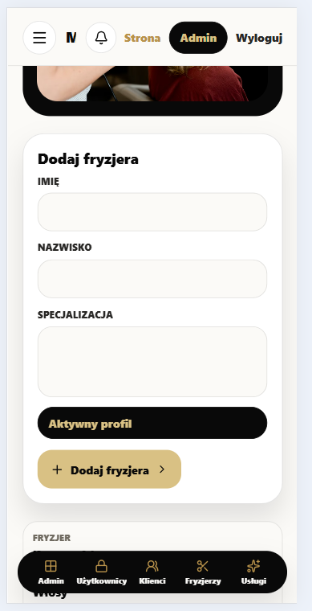

### 10.3. Historia klientów

Fryzjer ma dostęp do historii klientów powiązanych z jego wizytami.

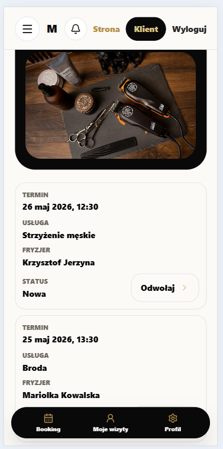

### 10.4. Profil fryzjera

Profil fryzjera w tym panelu jest tylko do podglądu. Edycja danych fryzjera oraz zdjęcia jest dostępna dla administratora.


## 11. Panel administratora

Panel administratora zawiera funkcje zarządzania całym systemem.

### 11.1. Dashboard administratora

Dashboard prezentuje statystyki systemu i szybkie akcje.

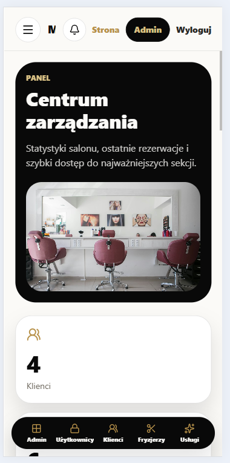

Administrator widzi m.in.:

- liczbę klientów,
- liczbę fryzjerów,
- liczbę usług,
- liczbę wizyt,
- ostatnie rezerwacje,
- przyciski szybkiego przejścia do sekcji zarządzania.

### 11.2. Użytkownicy i role

Administrator może zarządzać użytkownikami i ich rolami. Dla roli fryzjera możliwe jest przypisanie konta użytkownika do istniejącego profilu fryzjera.

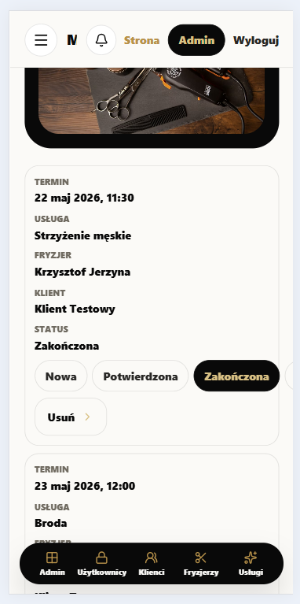

Obsługiwane role:

- klient,
- fryzjer,
- admin.

### 11.3. Klienci

Administrator może przeglądać, dodawać, edytować i usuwać klientów.

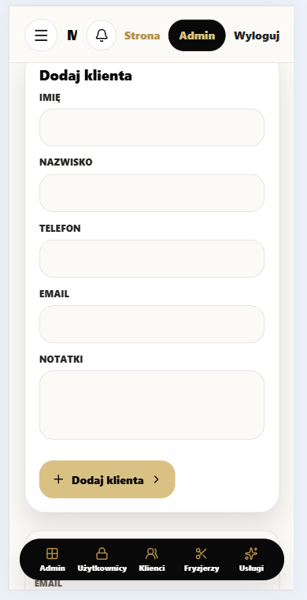

### 11.4. Fryzjerzy

Administrator może zarządzać profilami fryzjerów, ich specjalizacją, aktywnością i zdjęciem.


### 11.5. Usługi

Administrator może dodawać, edytować i usuwać usługi salonu.

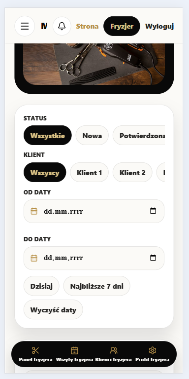

### 11.6. Wizyty

Administrator może przeglądać wszystkie wizyty, filtrować dane i zarządzać rekordami.

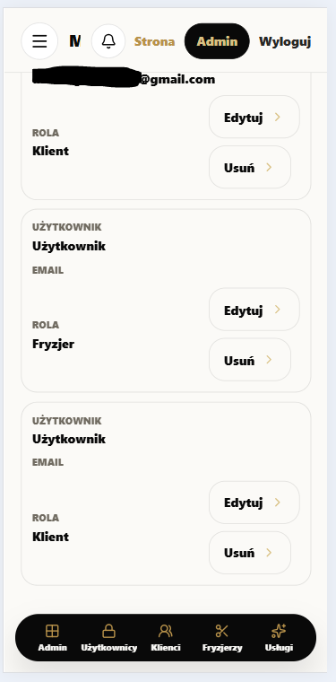

### 11.7. Opinie

Administrator może moderować opinie klientów: ukrywać, przywracać lub usuwać opinie.

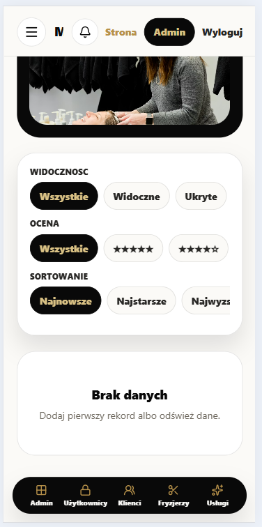

### 11.8. Galeria

Administrator może dodawać zdjęcia do galerii, edytować ich opis i usuwać zdjęcia.

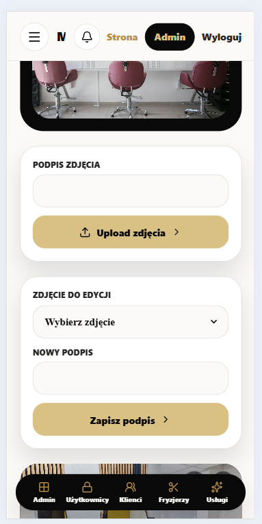

## 12. Integracja z backendem

Frontend komunikuje się z backendem Azure pod adresem:

```text
https://booking-api-fdgxg9cbc6chbqc8.francecentral-01.azurewebsites.net
```

Adres jest konfigurowany przez zmienne środowiskowe:

```text
EXPO_PUBLIC_API_BASE_URL
EXPO_PUBLIC_AUTH_BASE_URL
EXPO_PUBLIC_GOOGLE_WEB_CLIENT_ID
```

Najważniejsze integracje:

- pobieranie usług,
- pobieranie fryzjerów,
- pobieranie galerii,
- pobieranie opinii,
- tworzenie wizyty,
- anulowanie wizyty,
- zmiana statusu wizyty,
- upload zdjęć,
- moderacja opinii,
- zarządzanie rolami,
- logowanie przez Easy Auth,
- powiadomienia SignalR.

## 13. SignalR

SignalR służy do powiadomień realtime. Frontend łączy się z hubem:

```text
/hubs/booking-notifications
```

Połączenie jest tworzone w `src/api/signalr.ts`, a obsługa zdarzeń znajduje się w `src/hooks/useSignalR.ts`.

Przykładowe zastosowania:

- powiadomienie o nowej rezerwacji,
- powiadomienie testowe dla administratora,
- komunikaty toast dla użytkownika.

## 14. Responsywność i mobile-first

Aplikacja została zaprojektowana jako mobile-first. Widoki są przystosowane do małych ekranów, a następnie rozszerzane do desktopu.

Zastosowane rozwiązania:

- dolna nawigacja w panelach mobilnych,
- większe przyciski,
- przewijane listy i filtry,
- karty zamiast ciężkich tabel na mniejszych ekranach,
- safe area dla urządzeń mobilnych,
- układ SPA działający także na GitHub Pages.

Przykład widoku mobilnego:

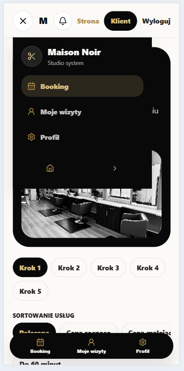

## 15. Design system

Interfejs został zaprojektowany w estetyce premium beauty/luxury:

- dominujące kolory: biel, czerń, grafit,
- akcenty złote,
- duże zaokrąglone karty,
- subtelne cienie,
- duże zdjęcia,
- mocna typografia,
- minimalistyczny układ.

Tokeny kolorów i stylów znajdują się w:

- `src/theme/tokens.ts`.

## 16. Testy E2E

Dla aplikacji przygotowano scenariusze testów end-to-end w formie nagrań ekranu.

### Test E2E-01: Gość przegląda aplikację i próbuje umówić wizytę

Cel:

Sprawdzenie publicznej części aplikacji oraz blokady rezerwacji dla niezalogowanego użytkownika.

Kroki:

1. Wejście na stronę główną.
2. Przejście do usług.
3. Sprawdzenie listy usług.
4. Przejście do fryzjerów.
5. Kliknięcie `Umów` przy fryzjerze.
6. Przekierowanie do logowania.

Wynik: PASS.

Nagranie:

`tests/E2E-01-gosc-publiczne-widoki-cropped.mp4`

### Test E2E-02: Klient loguje się i rezerwuje wizytę

Cel:

Sprawdzenie pełnego procesu rezerwacji wizyty przez istniejące konto klienta.

Kroki:

1. Logowanie przez Google.
2. Przejście do booking.
3. Wybór usługi.
4. Wybór fryzjera.
5. Wybór daty.
6. Wybór godziny.
7. Potwierdzenie rezerwacji.
8. Sprawdzenie wizyty w historii.

Wynik: PASS.

Nagranie:

`tests/E2E-02-klient-rezerwacja-wizyty-cropped.mp4`

### Test E2E-03: Administrator dodaje zdjęcie i edytuje opis

Cel:

Sprawdzenie działania panelu admina w zakresie zarządzania galerią.

Kroki:

1. Logowanie jako administrator.
2. Przejście do galerii admina.
3. Dodanie zdjęcia.
4. Wybranie zdjęcia do edycji.
5. Edycja opisu.
6. Sprawdzenie efektu w galerii.

Wynik: PASS.

Nagranie:

`tests/E2E-03-admin-galeria-cropped.mp4`

## 17. Uruchamianie projektu

### 17.1. Instalacja zależności

```bash
npm install
```

### 17.2. Uruchomienie wersji webowej

```bash
npm run web
```

Jeżeli port 8082 jest zajęty, można użyć:

```bash
npm run web:8083
```

### 17.3. Typecheck

```bash
npm run typecheck
```

### 17.4. Build webowy

```bash
npm run build
```

Build tworzy katalog `dist`, który może być użyty do hostowania wersji webowej.

## 18. Hosting

Frontend może być hostowany jako statyczna aplikacja webowa. W projekcie został przygotowany eksport webowy Expo oraz obsługa ścieżek dla GitHub Pages.

Docelowy adres wersji webowej:

```text
https://ziomus1357.github.io/HairSalonBookingFrontend/
```

Backend działa niezależnie w Azure App Service.

## 19. Podsumowanie

Maison Noir Booking jest kompletnym frontendem dla systemu rezerwacji wizyt w salonie fryzjerskim. Aplikacja wykorzystuje nowoczesny stos technologiczny, integruje się z backendem chmurowym, obsługuje role użytkowników, autoryzację, rezerwacje, upload zdjęć, opinie, panele administracyjne i powiadomienia realtime.

Najważniejsze zalety projektu:

- pełna aplikacja SPA zamiast statycznego landing page,
- rozbudowany podział na role,
- realna integracja z backendem,
- estetyczny interfejs premium,
- obsługa web i mobile,
- testy E2E udokumentowane nagraniami,
- gotowość do hostowania i prezentacji jako projekt zaliczeniowy.
